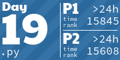

# Advent of Code

My solutions for [Advent of Code](https://adventofcode.com/)

**2021** - [Python](https://github.com/augini/advent-of-code/tree/master/2021)

**2022** - [Python](https://github.com/augini/advent-of-code/tree/master/2022)

**2023** - [Dart](https://github.com/augini/advent-of-code/tree/master/2023)

**2024** - [JavaScript](https://github.com/augini/advent-of-code/tree/master/2024)

<!-- AOC TILES BEGIN -->
<h1 align="center">
  2024 - 2 ⭐
</h1>

<h1 align="center">
  2023 - 26 ⭐
</h1>

<h1 align="center">
  2022 - 30 ⭐
</h1>

<h1 align="center">
  2021 - 50 ⭐
</h1>

<h1 align="center">
  2020 - 8 ⭐
</h1>

<!-- AOC TILES END -->